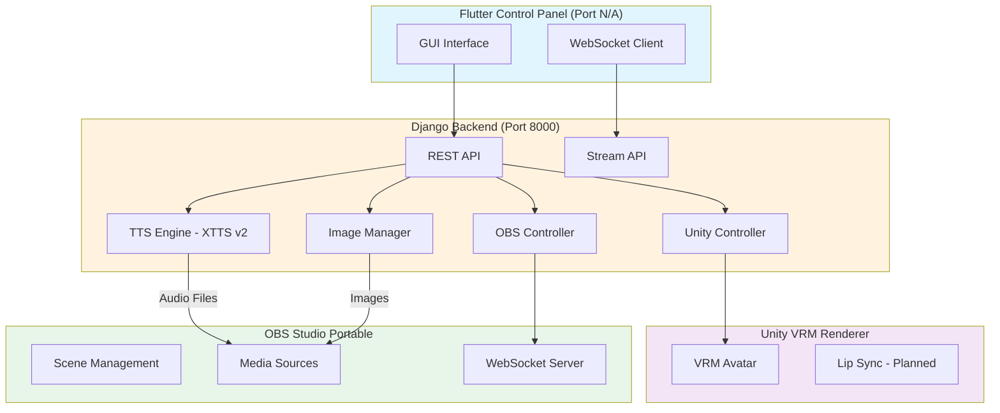

# 🎤 Live Idol Clone - AI VTuber System

A **completely local AI VTuber** system that integrates Text-to-Speech (TTS), 3D avatar rendering, and live streaming capabilities—all running on your machine with zero cloud dependencies.


---

## ✨ Features

### 🎯 Core Capabilities
- **🎙️ Advanced Text-to-Speech**: Powered by XTTS v2 with multi-language support
- **🎨 3D Avatar Rendering**: Unity-based VRM avatar visualization with real-time control
- **📹 Live Broadcasting**: Integrated OBS WebSocket control for seamless streaming
- **🖼️ Image Management**: Upload, crop, and manage avatar images, backgrounds, and overlays
- **⚡ Real-time Status**: WebSocket-based live status updates for all components
- **🎮 Desktop Control Panel**: Flutter-based GUI for easy system management

### 🛠️ Advanced Features
- **Multi-format Image Support**: JPG, PNG, GIF, WebP with drag-and-drop upload
- **Image Cropping**: Built-in crop tool with multiple aspect ratios
- **Favorites System**: Mark and filter favorite images
- **Bulk Operations**: Multi-select and batch delete images
- **Live Preview**: Real-time OBS stream preview in the control panel
- **Auto-Launch**: One-click startup for all components (Unity, OBS, Backend)
- **Zero Configuration**: Pre-configured OBS portable with WebSocket integration

---

## 🏗️ System Architecture



### Component Details

#### 1. **Backend (Django + Python)**
- **Framework**: Django 4.2.7 with Django REST Framework
- **TTS Engine**: Coqui TTS (XTTS v2) with PyTorch acceleration
- **APIs Provided**:
  - `/api/health` - Health check endpoint
  - `/api/status` - System status (TTS, Unity, OBS)
  - `/api/speak` - Text-to-speech generation
  - `/api/voice-profiles` - Voice profile management
  - `/api/images/*` - Image upload, list, delete, favorites
  - `/api/obs/connect` - OBS WebSocket connection
  - `/api/obs/launch` - Launch OBS Studio
  - `/api/obs/set-background` - Set background image
  - `/api/obs/add-overlay` - Add overlay image
  - `/api/unity/launch` - Launch Unity renderer
  - `/api/stream/preview` - Live stream preview (WebSocket)

#### 2. **Frontend (Flutter Desktop)**
- **Framework**: Flutter 3.0+ for Windows/macOS/Linux
- **Key Features**:
  - Real-time status monitoring via WebSocket
  - System component control (Unity, OBS launch)
  - Text input for speech generation
  - Image upload with drag & drop support
  - Image cropper integration
  - Live OBS preview
  - Favorite filtering and search
  - Bulk image operations

#### 3. **Renderer (Unity 2021.3 LTS)**
- **Asset Support**: VRM avatar models
- **Features**:
  - 3D character rendering
  - Lip sync support (planned)
  - Animation control via API
  - Transparent background output for OBS

#### 4. **Broadcaster (OBS Studio Portable)**
- **Control**: WebSocket API (Port 4455-4499, auto-selected)
- **Pre-configured Scenes**:
  - Main scene with avatar + background
  - Media sources for TTS audio playback
  - Image sources for backgrounds and overlays
- **No Manual Setup Required**: Zero VB-CABLE, no audio routing needed

---

## 📋 Requirements

### For End Users (Running the Application)
- **OS**: Windows 10/11 (x64), macOS 10.15+, or Linux (Ubuntu 20.04+)
- **RAM**: 8GB minimum, 16GB recommended
- **Disk Space**: ~5GB for installation + models
- **GPU**: Optional (NVIDIA GPU with CUDA support for faster TTS)

> **Note**: The installer bundles everything—no prerequisites needed!

### For Developers (Building from Source)

#### Essential Tools
- **Python**: 3.10 or 3.11 (with pip)
- **Flutter**: 3.0+ ([Installation Guide](https://docs.flutter.dev/get-started/install))
- **Unity Hub**: Latest version
- **Unity Editor**: 2021.3 LTS ([Download](https://unity.com/releases/editor/archive))
- **Inno Setup**: 6+ for creating Windows installer ([Download](https://jrsoftware.org/isdl.php))

#### Optional (Auto-downloaded by build script)
- OBS Studio Portable
- Python dependencies (see `backend/requirements.txt`)
- Flutter dependencies (see `flutter_app/pubspec.yaml`)

---

## 🚀 Quick Start

### Option 1: Using Pre-built Installer (Recommended)

1. **Download** the latest installer from [Releases](https://github.com/your-username/live-idol-clone/releases)
2. **Run** `LiveIdolCloneInstaller.exe`
3. **Launch** the application from your Desktop shortcut
4. **Click** "Launch Unity" and "Launch OBS" in the control panel
5. **Type** your text and click "Speak" to test TTS

### Option 2: Building from Source

#### Step 1: Clone Repository
```bash
git clone https://github.com/your-username/live-idol-clone.git
cd live-idol-clone
```

#### Step 2: Prepare External Files

##### OBS Portable Setup
1. Download [OBS Studio Portable](https://obsproject.com/download) (Windows Portable ZIP)
2. Extract to `installer/files/obs-studio-portable/`
3. Verify that `installer/files/obs-studio-portable/bin/64bit/obs64.exe` exists

##### Unity Project Setup
See detailed instructions in [`docs/UNITY_SETUP.md`](docs/UNITY_SETUP.md):
1. Open Unity Hub
2. Create/Open project at `unity_vrm/`
3. Import VRM SDK
4. Add scripts from `unity_vrm_scripts/`
5. Build to `unity_vrm_scripts/build/VRMRenderer.exe`

#### Step 3: Run Smart Build Script

**Windows:**
```cmd
build.bat
```

The script will:
- ✅ Auto-detect Python & Flutter (or download portable versions)
- ✅ Install all dependencies
- ✅ Download TTS models (~1.5GB)
- ✅ Build Django backend executable
- ✅ Build Flutter desktop app
- ✅ Detect Unity build
- ✅ Create installer with Inno Setup

**Build Output:**
- `build_output/backend/` - Django backend executable
- `build_output/flutter/` - Flutter app executable
- `build_output/unity/` - Unity renderer executable
- `installer/output/LiveIdolCloneInstaller.exe` - Final installer

#### Step 4: Run the Installer
```cmd
installer\output\LiveIdolCloneInstaller.exe
```

---

## 📖 Usage Guide

### Initial Setup

1. **Launch the Application**
   - Open "Live Idol Clone" from Desktop shortcut or Start Menu
   
2. **Verify Backend Status**
   - Check that "Backend" indicator is green
   - Wait for "TTS Engine" to show "Initialized"

3. **Launch Components**
   - Click **"Launch Unity"** → Wait for Unity window to appear
   - Click **"Launch OBS"** → OBS will start in background
   - Connection should auto-establish (Port 4455-4499)

### Working with Images

#### Upload Images
1. Navigate to the **"Livestream Images"** section
2. Select a tab: **Avatar**, **Background**, or **Overlay**
3. **Upload Methods**:
   - Click **"Upload Image"** to select a single file
   - Click **"Batch Upload"** for multiple files
   - **Drag and drop** images directly onto the section
4. **Optional**: Crop images before uploading

#### Manage Images
- **Set as Background**: Click the wallpaper icon (Background tab only)
- **Favorite**: Click the star icon to mark as favorite
- **Delete**: Click the trash icon
- **Bulk Delete**: Enable select mode, choose multiple images, delete all

#### Filter & Search
- Use the **search bar** to filter by filename
- Filter by: **All**, **Favorites**, **Recent**

### Generating Speech

1. **Enter Text** in the input box (multi-line supported)
2. **Click "Speak"**
3. Backend generates audio using XTTS v2 (~2-5 seconds)
4. Audio plays automatically in OBS

### Live Preview

- Enable OBS WebSocket
- View real-time preview in the "Video Preview" section
- Preview updates at 10 FPS

---

## 🧩 Troubleshooting

### Common Issues

#### Backend Won't Start
**Symptoms**: "Backend: Not running" (red indicator)

**Solutions**:
1. Check if port 8000 is already in use:
   ```cmd
   netstat -ano | findstr :8000
   ```
2. Check `backend_crash_log.txt` for error details
3. Ensure TTS models are downloaded (~1.5GB in `%USERPROFILE%/.local/share/tts/`)

#### TTS Generation Fails
**Error**: "Microsoft Visual C++ 14.0 or greater is required"

**Fix (Windows)**:
```cmd
# Option 1: Using winget (Administrator CMD)
winget install -e --id Microsoft.VisualStudio.2022.BuildTools --override "--passive --wait --add Microsoft.VisualStudio.Workload.VCTools --includeRecommended"

# Option 2: Manual download
# Install from: https://visualstudio.microsoft.com/visual-cpp-build-tools/
# Select "Desktop development with C++"
```

#### Unity Won't Launch
**Symptoms**: Clicking "Launch Unity" does nothing

**Solutions**:
1. Verify `VRMRenderer.exe` exists:
   - Installation: `C:\Program Files\Live Idol Clone\unity\VRMRenderer.exe`
   - Development: `unity_vrm_scripts\build\VRMRenderer.exe`
2. Check if Unity is already running (Task Manager)
3. Review [`docs/UNITY_SETUP.md`](docs/UNITY_SETUP.md) for build instructions

#### OBS Won't Connect
**Symptoms**: "OBS Link: Disconnected" (red indicator)

**Solutions**:
1. Check if OBS is running (Task Manager → `obs64.exe`)
2. Backend auto-selects port 4455-4499 (check logs)
3. Manually launch OBS:
   - Installation: `C:\Program Files\Live Idol Clone\obs-studio-portable\bin\64bit\obs64.exe`
4. Click **"Connect to OBS WebSocket (Manual)"** button
5. Ensure Windows Firewall isn't blocking OBS

#### Build Fails (Developers)
**Check**:
- `build.log` for detailed error messages
- Internet connection for downloading dependencies
- Available disk space (min 10GB free)

**Portable Python Issues**:
If portable Python fails to compile TTS:
1. Install full Python 3.10.11: https://www.python.org/downloads/
2. Check "Add Python to PATH" during installation
3. Re-run `build.bat`

For more issues, see [`docs/TROUBLESHOOTING.md`](docs/TROUBLESHOOTING.md)

---

## 🗂️ Project Structure

```
live-idol-clone/
├── backend/                    # Django REST API Backend
│   ├── api/                   # API endpoints
│   │   ├── views.py          # REST API views
│   │   ├── tts_engine.py     # XTTS v2 integration
│   │   ├── obs_control.py    # OBS WebSocket control
│   │   ├── unity_control.py  # Unity process management
│   │   ├── image_manager.py  # Image upload/management
│   │   ├── favorites.py      # Image favorites system
│   │   └── obs_stream.py     # WebSocket streaming
│   ├── config/               # Django settings
│   ├── requirements.txt      # Python dependencies
│   ├── run_server.py         # Server entry point
│   └── build_backend.py      # PyInstaller build script
│
├── flutter_app/               # Flutter Desktop Frontend
│   ├── lib/
│   │   ├── main.dart         # App entry point
│   │   ├── screens/          # UI screens
│   │   │   └── home_screen.dart
│   │   ├── widgets/          # Reusable widgets
│   │   │   ├── status_indicator.dart
│   │   │   ├── video_preview_widget.dart
│   │   │   └── image_upload_section.dart
│   │   ├── services/         # Backend communication
│   │   │   ├── api_client.dart
│   │   │   └── backend_service.dart
│   │   └── models/           # Data models
│   │       └── api_models.dart
│   └── pubspec.yaml          # Flutter dependencies
│
├── unity_vrm/                 # Unity VRM Project
│   └── Assets/
│       ├── Scripts/          # C# scripts
│       ├── VRM/              # VRM SDK
│       └── StreamingAssets/  # Runtime assets
│
├── unity_vrm_scripts/         # Unity source scripts
│   ├── *.cs                  # C# source files
│   └── build/                # Unity build output
│       └── VRMRenderer.exe
│
├── installer/                 # Inno Setup installer
│   ├── setup.iss             # Installer script
│   ├── files/                # Bundled files
│   │   ├── backend/
│   │   ├── flutter/
│   │   ├── unity/
│   │   └── obs-studio-portable/
│   └── output/               # Generated installers
│
├── docs/                      # Documentation
│   ├── UNITY_SETUP.md        # Unity build guide
│   └── TROUBLESHOOTING.md    # Troubleshooting guide
│
├── build.bat                  # Smart build script (Windows)
├── build_output/             # Build artifacts (generated)
├── portable_tools/           # Downloaded portable tools (generated)
└── README.md                 # This file
```

---

## 🔧 Configuration

### Backend Configuration

**Port**: 8000 (default)  
**Config File**: `backend/config/settings.py`

Key settings:
```python
# TTS Configuration
TTS_MODEL = 'tts_models/multilingual/multi-dataset/xtts_v2'
TTS_DEVICE = 'cuda' if torch.cuda.is_available() else 'cpu'

# OBS WebSocket
OBS_PORT_RANGE = (4455, 4499)  # Auto-select available port
OBS_PASSWORD = None              # No password by default

# Media Paths
MEDIA_ROOT = 'media/'
IMAGES_ROOT = 'media/images/'
```

### OBS Configuration

**WebSocket Server**: Automatically configured  
**Port**: 4455-4499 (auto-selected first available)  
**Password**: None (local access only)

Pre-configured scenes:
- **Main Scene**: Avatar + Background + Overlays
- **Audio Source**: TTS output media source

### Unity Configuration

**Resolution**: 1920x1080 (configurable)  
**Background**: Transparent (alpha channel enabled)  
**Output**: Sent to OBS via Window Capture

---

## 🧪 Development

### Running in Development Mode

#### Backend (Django)
```bash
cd backend
python -m venv venv
source venv/bin/activate  # Windows: venv\Scripts\activate.bat
pip install -r requirements.txt
python manage.py runserver
```

#### Frontend (Flutter)
```bash
cd flutter_app
flutter pub get
flutter run -d windows  # or macos, linux
```

#### Unity
1. Open `unity_vrm/` in Unity Editor
2. Press Play to test in editor
3. Build Settings → Windows x64 → Build

### Adding New Features

#### New Backend API Endpoint
1. Add view function in `backend/api/views.py`
2. Register URL in `backend/api/urls.py`
3. Add corresponding method in `flutter_app/lib/services/api_client.dart`

#### New Flutter Widget
1. Create widget file in `flutter_app/lib/widgets/`
2. Import and use in `flutter_app/lib/screens/home_screen.dart`

### Testing

**Backend Tests**:
```bash
cd backend
python manage.py test
```

**Flutter Tests**:
```bash
cd flutter_app
flutter test
```

---

## 📦 Dependencies

### Backend (Python)
| Package | Version | Purpose |
|---------|---------|---------|
| Django | 4.2.7 | Web framework |
| djangorestframework | 3.14.0 | REST API |
| TTS | 0.22.0 | Text-to-Speech (XTTS v2) |
| torch | 2.1.0 | PyTorch (TTS backend) |
| obs-websocket-py | 1.0 | OBS control |
| Pillow | 10.0.0+ | Image processing |
| websockets | 13.0+ | WebSocket streaming |

### Frontend (Flutter)
| Package | Version | Purpose |
|---------|---------|---------|
| http | ^1.1.0 | HTTP client |
| web_socket_channel | ^2.4.0 | WebSocket client |
| file_picker | ^6.1.1 | File selection |
| image_picker | ^1.0.4 | Image picker |
| desktop_drop | ^0.4.4 | Drag & drop |
| image_cropper | ^5.0.1 | Image cropping |
| path_provider | ^2.1.1 | File paths |

---

## 🤝 Contributing

Contributions are welcome! Please follow these guidelines:

1. **Fork** the repository
2. **Create** a feature branch (`git checkout -b feature/amazing-feature`)
3. **Commit** your changes (`git commit -m 'Add amazing feature'`)
4. **Push** to the branch (`git push origin feature/amazing-feature`)
5. **Open** a Pull Request

### Code Style
- **Python**: Follow PEP 8 (use `black` formatter)
- **Dart/Flutter**: Follow official Dart style guide (use `dart format`)
- **C# (Unity)**: Follow Unity C# coding conventions

### Testing Before PR
- Run `build.bat` to ensure all components build successfully
- Test all modified features end-to-end
- Update documentation if needed

---

## 📄 License

This project is licensed under the **MIT License** - see the [LICENSE](LICENSE) file for details.

---

## 🙏 Acknowledgments

- **Coqui TTS** - Text-to-Speech engine ([GitHub](https://github.com/coqui-ai/TTS))
- **VRM Consortium** - VRM avatar format ([Website](https://vrm.dev/en/))
- **OBS Studio** - Broadcasting software ([Website](https://obsproject.com/))
- **Flutter Team** - Cross-platform framework ([Flutter](https://flutter.dev/))
- **Unity Technologies** - Game engine ([Unity](https://unity.com/))

---

## 📞 Support

- **Issues**: [GitHub Issues](https://github.com/your-username/live-idol-clone/issues)
- **Discussions**: [GitHub Discussions](https://github.com/your-username/live-idol-clone/discussions)
- **Documentation**: [`docs/`](docs/) folder

---

## 🗺️ Roadmap

### Current Version (1.0.0)
- ✅ Text-to-Speech with XTTS v2
- ✅ Unity VRM renderer
- ✅ OBS WebSocket integration
- ✅ Flutter control panel
- ✅ Image management system
- ✅ Real-time status monitoring

### Planned Features
- 🔄 **Lip Sync**: Real-time lip synchronization with audio
- 🔄 **Voice Cloning**: Custom voice profile training
- 🔄 **Chat Integration**: TikTok/Shopee Live chat reading
- 🔄 **Animation System**: Gesture and expression controls
- 🔄 **Multi-Language**: Expanded language support
- 🔄 **Cloud Deployment**: Optional cloud-based setup guide
- 🔄 **Mobile Companion**: Flutter mobile app for remote control

---

**Made with ❤️ for the VTuber community**
